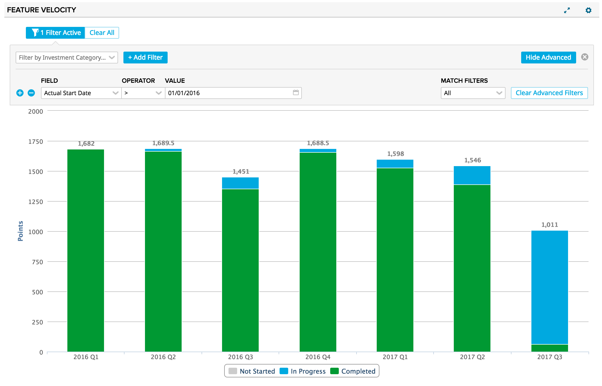
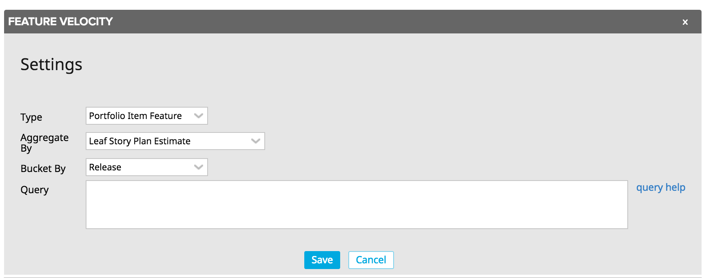

# PI Throughput/Velocity Chart

This app plots the velocity or throughput of portfolio items based on their ActualEndDate.  Metrics can be calculated using a variety of rollup fields (LeafStoryPlanEstimateTotal, RefinedEstmate, Count, etc.).  The app can be configured for any level of the portfolio item hierarchy and the x-axis granularity is configurable as well.  This app includes the standard filtering component to enable further slicing and dicing of data.

## Installation and Settings
The app is installed as a Custom HTML App ([see help documentation](https://help.rallydev.com/custom-html))
Once the app is installed, use the gear menu on the app panel and select "Edit App Settings".

####  Type
Pick the Portfolio Item type you'd like to chart.  Defaults to the lowest level PI.

#### Aggregate By
Pick the field to use for the aggregation.  Available values include Accepted Leaf Story Count, Accepted Leaf Story Plan Estimate, Count, Leaf Story Count, Leaf Story Plan Estimate, Preliminary Estimate, and Refined Estimate.

#### Bucket By
Pick the timeframe for which to generate values along the x-axis.  Portfolio Items will be aggregated into these buckets based on the value of their ActualEndDate field.  Available options include month and quarter.  Release is also an available option if the lowest level PI type is selected above.

#### Query
In addition to the advanced filtering component in the app, you can write your own complex filter queries. [Extensive documentation](https://help.rallydev.com/grid-queries?basehost=https://rally1.rallydev.com) is available. This might be useful if you want to always limit the chart to certain complex criteria.
